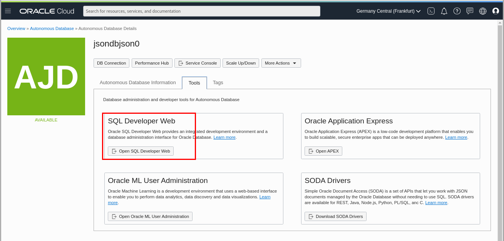

# Connect to the workshop environment

## **Introduction**

This lab walks you through the steps to get connect to Oracle Cloud and to the Autonomous Database instance that has been provisioned for you for the duration of this workshop.

Estimated time: 5 minutes

### Objectives

- Learn how to connect to Oracle Cloud
- Learn how to connect to Autonomous Database with SQL Developer Web via the console
- [Optional] Learn how to connect to Autonomous Database with SQL Developer locally on your desktop

## **STEP 1**: Connect to the Oracle Cloud UI

1. Go to [cloud.oracle.com](https://cloud.oracle.com)

    use "oractdemeabdmautodb" as the cloud account name
    

2. Enter the login and password that were provided to you 

    
    (login is like "jsonX" where X is the student number allocated to you)

3. Enter a new password

    
    You can use https://passwordsgenerator.net/ to generate a new one. 

2. Once you are logged in, you are taken to the cloud services dashboard where you can see all the services available to you. Click the navigation menu in the upper left to show top level navigation choices.

    __Note:__ You can also directly access your Autonomous Databases through the __Quick Actions__ section of the dashboard.

    

3. The following steps apply similarly to Autonomous Data Warehouse, Autonomous Transaction Processing or Autonomous JSON Database. This lab will use Autonomous JSON Database, so click **Autonomous JSON Database**.

    

4. Go under **Compartments** and select the only compartment you have access to, it has the form of "comp_jsonX" where X is the student number allocated to you. 

    

5. You can now see the JSON database that has been provisioned for this lab

    

## **STEP 2**:  Explore the JSON Databas UI

1. Select the AJD database.

    

2. This brings up the __Autonomous Database Information__ screen.

    

## **STEP 3**: Connect to your AJD with SQL Developer Web

1.  While in your database **OCI console** click the **Tools** tab.

    

3.  The Tools page provides you access to SQL Developer Web, Oracle Application Express, Oracle ML User Administration, etc. In the SQL Developer Web box, click **Open SQL Developer Web**.

    

4.  A sign-in page opens for the SQL Developer Web. For this lab, simply use your database instance's default administrator account, **Username - ADMIN**, and with the admin **Password** you specified when creating the database. Click **Sign in**.

    

5.  SQL Developer Web opens on a worksheet tab. The first time you open the SQL Developer Web, a series of pop-up informational boxes introduce you to the main features. If you are familiar with the desktop version of SQL Developer, many of the same [shortcut keys](https://docs.oracle.com/en/database/oracle/sql-developer-web/19.2.1/sdweb/worksheet-page.html#GUID-3B651F54-DE41-42BD-B643-19741A25213A) can be used in this browser-based version too.

Copy and run this dummy query in your worksheet to see that you are now connected to your Autonomous Database!

    <copy>
    select * from dual;
    </copy>

## **STEP 4**: (Optional) Connect to your AJD with local SQL Developer

An alternative to SQL Web Developer is to run SQL Developper locally on your desktop and connect to the Autonomous Database.

Autonmous database connection are secured with...
For that you'll need to download the instance Wallet and configure a connection into SQL Developer.

1. Download the instance wallet

    While in your database **OCI console** click the **DB Connection** button
    

    A pop-up screen will appear. Click on the **Download Wallet** button.
    

    You will be prompted for a password for this wallet. Enter any value as we won't need this feature and click the download button.
    

2. Create and test the database connection

    If not done already, download and install SQL Developer from https://www.oracle.com/tools/downloads/sqldev-downloads.html

    Open SQL Developer and create a new Database Connection
    

    

    Fill the following informations : 
        - **name** for the connection name   
        - **Username** should be "ADMIN"  
        -  **Password** (select the **"save Password** option)  
        - select **Cloud Wallet** for the Connection Type
        - using the **Browse** button and select the Wallet zip file that you downloaded on step 1
        
    Finally click the **Connect** button.
    

    If the connection details are OK, a window will open where you can test the connection with a dummy sql statement

        select * from dual;

    

